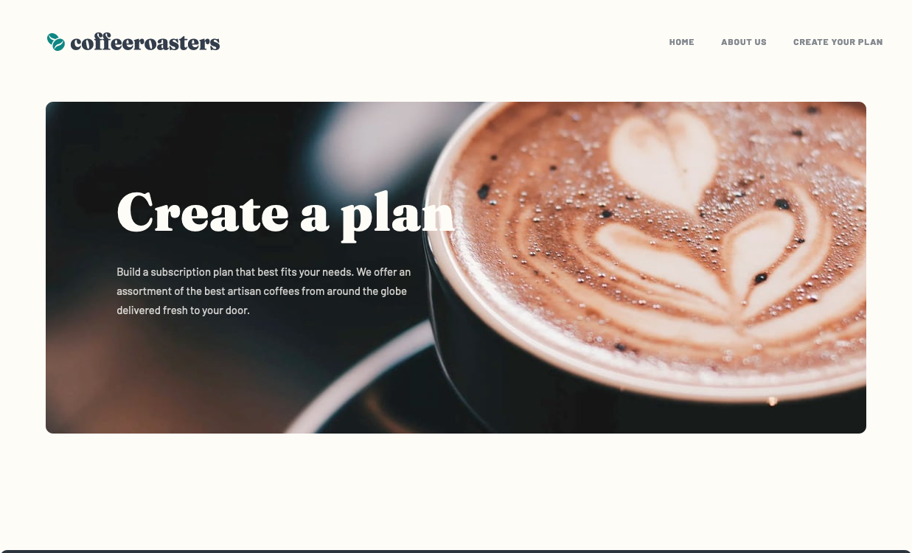
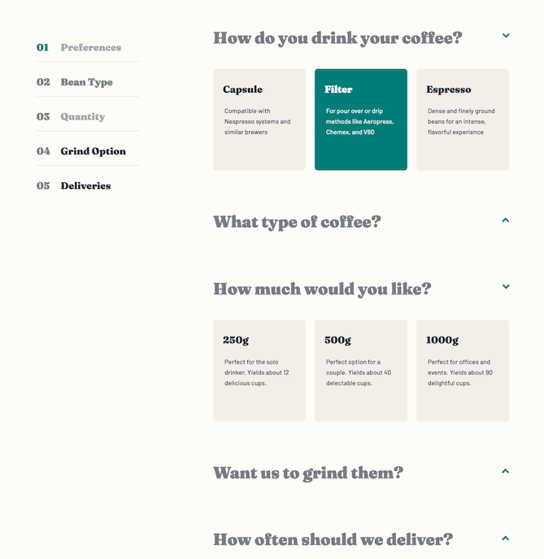
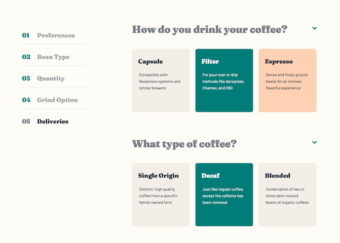
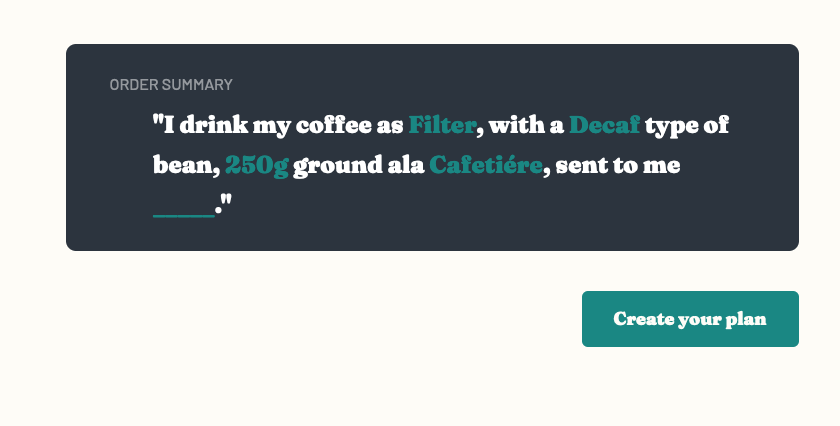

# Frontend Mentor - Coffeeroasters subscription site solution

This is a solution to the [Coffeeroasters subscription site challenge on Frontend Mentor](https://www.frontendmentor.io/challenges/coffeeroasters-subscription-site-5Fc26HVY6). Frontend Mentor challenges help you improve your coding skills by building realistic projects.

## Table of contents

- [Frontend Mentor - Coffeeroasters subscription site solution](#frontend-mentor---coffeeroasters-subscription-site-solution)
  - [Table of contents](#table-of-contents)
  - [Overview](#overview)
    - [The challenge](#the-challenge)
    - [Screenshot](#screenshot)
    - [Links](#links)
  - [My process](#my-process)
    - [Built with](#built-with)
    - [What I learned](#what-i-learned)
    - [Continued development](#continued-development)
    - [Useful resources](#useful-resources)
  - [Author](#author)

## Overview

### The challenge

Users should be able to:

- View the optimal layout for each page depending on their device's screen size
- See hover states for all interactive elements throughout the site
- Make selections to create a coffee subscription and see an order summary modal of their choices

### Screenshot









### Links

- Solution URL: [Github Code](https://github.com/VLOrozco/coffee-roasters-subscription-site.git)
- Live Site URL: [Coffeeroasters Subscription Site](https://vlorozco.github.io/coffee-roasters-subscription-site/)

## My process

For this project my workflow began with searching through the design files provided by the [Frontend Mentor](https://www.frontendmentor.io) Challenge and proceeded to draw each page into a sketched wireframe with notes on semantic html, repeated style patterns, and changes to make the site responsive over multiple screen sizes. Then focused on recreating the provided Figma design system in html and css format to support the building and consistency of each site page. Next, I began working on the site one page at a time beginning with Home, then About Us, followed by Create Your Plan. With each page, I first worked on the semantic html and text content, then moved on to styling the page with css with a mobile-first workflow and lastly focused on logic required for the each page feature to be written in Vanilla JavaScript.

### Built with

- HTML
- CSS
- Mobile-first workflow
- Vanilla JavaScript
- JavaScript Window.sessionStorage
- Accessible Rich Internet Applications (ARIA)

### What I learned

This was my first project working with `sessionStorage`, which is utilized to store the data selected within a browsers tab. If the tab is closed and the webpage is opened in a new tab, the data will not be stored and on the plan page you will be working with a blank order form. If you stay on the same tab, but accidentally refresh the page, the data will be stored on that particular window tab, keeping the styling for each item that has been selected previously. While there are other approaches to storing data, such as `cookies` and `localStorage`, I chose the `sessionStorage` approach for this particular project as the data being saved was at a small capacity and the data is only necessary for one tab at a time, allowing a user to start with a blank form in a different tab.

Below is the first declaration of accessing `keys` and `values` in the `sessionStorage`. It is called globally to `.sessionStorage.getItem()` and within the `orderButtons` `eventListener`, in order to  `sessionStorage.setItem()`. This updates the contents and styling for the current browser tab `sessionStorage` for each corresponding selection.

```js
let keys = Object.keys(sessionStorage);
let values = Object.values(sessionStorage);
// SessionStorage value strings
const preferenceString = sessionStorage.getItem("preference");
const beanTypeString = sessionStorage.getItem("beanType");
const quantityString = sessionStorage.getItem("quantity");
const grindOptionString = sessionStorage.getItem("grindOption");
const deliveriesString = sessionStorage.getItem("deliveries");
```

In this challenge, I struggled with styling only 1 button per question. While it was a challenge for me at this point in my frontend journey, I truly am proud of the code I wrote for this solution. My code iterats through each button and only styles if the index `c` of a button is within a particular index range, and if the `dataset.value` matches the `sessionStorage` value saved in the `orderSelectionObj` according to its corresponding key. This function is called globally and locally in the `orderButtons` event listener. This allows for the styling to be updated once a user selects a new button option.

Here is my solution for accomplishing this styling:

```js
function styleButtons() {
  for(let c = 0; c <= buttons.length; c++) {
    // Style button if the following conditions are met
    // Fits index range
    // Button value matches the sessionStorage value
    if ((c >= 0 && c <= 2) && (buttons[c].dataset.value !== orderSelectionObj.preferenceOrder) || (c >= 3 && c <= 5) && (buttons[c].dataset.value !== orderSelectionObj.beanTypeOrder) || (c >= 6 && c <= 8) && (buttons[c].dataset.value !== orderSelectionObj.quantityOrder) || (c >= 9 && c <= 11)  && (buttons[c].dataset.value !== orderSelectionObj.grindOptionOrder) || (c >= 12 && c <= 14) && (buttons[c].dataset.value !== orderSelectionObj.deliveriesOrder)) {

      buttons[c].classList.remove("active");

    } else if ((c >= 0 && c <= 2) && (buttons[c].dataset.value == orderSelectionObj.preferenceOrder) || (c >= 3 && c <= 5) && (buttons[c].dataset.value == orderSelectionObj.beanTypeOrder) || (c >= 6 && c <= 8) && (buttons[c].dataset.value == orderSelectionObj.quantityOrder) || (c >= 9 && c <= 11)  && (buttons[c].dataset.value == orderSelectionObj.grindOptionOrder) || (c >= 12 && c <= 14) && (buttons[c].dataset.value == orderSelectionObj.deliveriesOrder)) {

      buttons[c].classList.add("active");

    }

  } // for loop "c", buttons.length end

} // styleButtons() function end
```

### Continued development

Following this project I will continue building sites to reinforce and develop my skills with JavaScript and in working with ARIA labels to assure that my sites are accessible and enjoyable by all users.

### Useful resources

- [mdn web docs Window: sessionStorage property](https://developer.mozilla.org/en-US/docs/Web/API/Window/sessionStorage) - This was my first time working with sessionStorage, this doc reference helped in storing the coffee order data to the window tab. Should a user exit the tab their data will be cleared, else if the page reloads the content will still be available and the user will not lose their order selections.

- [What the heck is ARIA? A Beginner's Guide to ARIA for Accessibility](https://www.lullabot.com/articles/what-heck-aria-beginners-guide-aria-accessibility) - This article was written by Kat Shaw was another great resource in learning ARIA roles and states & properties.

- [WAI-ARIA document structure roles](https://www.w3.org/TR/wai-aria/#document_structure_roles) - This helped me in selecting the appropriate ARIA labels to include in html documents.

- [mdn web docs | WAI-ARIA Roles](https://developer.mozilla.org/en-US/docs/Web/Accessibility/ARIA/Roles) - Well who doesn't love working with documents from mdn web docs. There is great content on this application for developing skills and referencing necessary docs.

- [Using HTML landmark roles to improve accessibility](https://developer.mozilla.org/en-US/blog/aria-accessibility-html-landmark-roles/) - Upon typing this README file, I came across a featured article on mdn docs written by Schalk Neethling, which contains valuable and updated content in regards to roles for improved accessibility.

- [w3.org | ARIA Authoring Practices Guide(APG)](https://www.w3.org/WAI/ARIA/apg/patterns/) - This site has great examples and patterns for commonly used frontend features. I will be referring to this webpage to support building future projects.

- [Remove/Delete Last Commit](https://practicalgit.com/blog/remove-last-commit.html) - Because everyone's been there at some point, I made a commit I needed to remove as I accidentally committed to the wrong file locally. Whoops! Well this blog post was very helpful to fix this matter.

## Author

- Github - [Veronica L. Orozco](https://github.com/VLOrozco)
- Frontend Mentor - [@VLOrozco](https://www.frontendmentor.io/profile/VLOrozco)
- Codecademy - [orozcov3](https://www.codecademy.com/profiles/orozcoV3)
- LinkedIn - [Veronica Orozco](https://www.linkedin.com/in/veronica-orozco-710b46166/)
